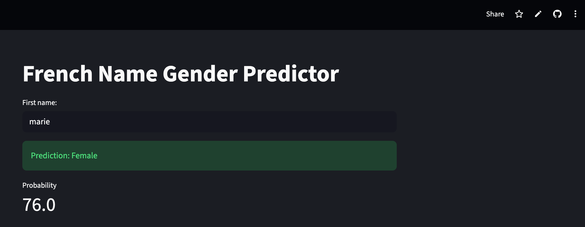
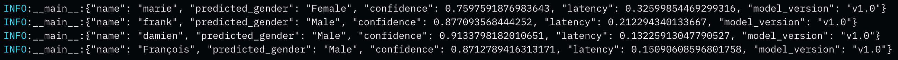
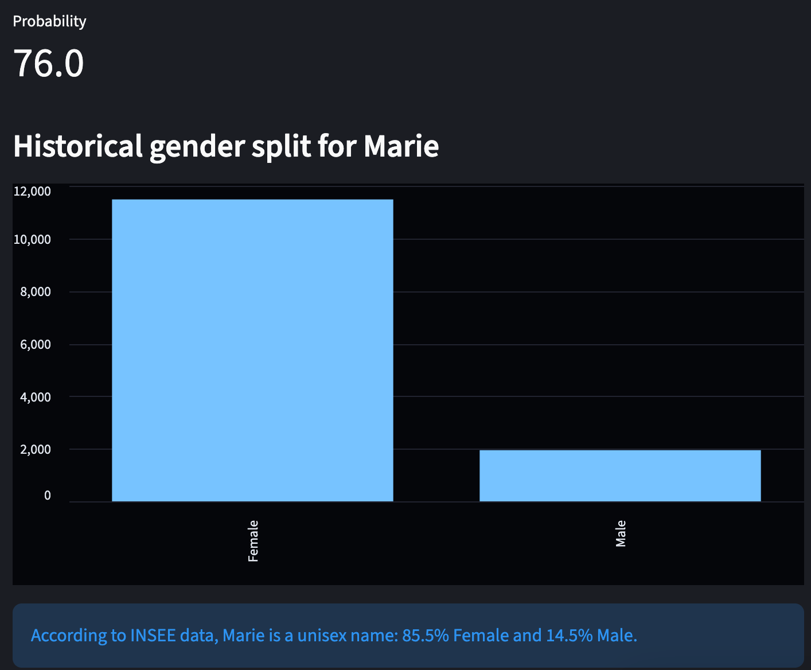

# French name-to-gender predictor (Deep Learning)

## 1. Description 
This is an end-to-end machine learning application that predicts a person's gender based on their first name, trained on historical French demographic dataset [INSEE - National Institute of Statistics and Economic Studies](https://www.insee.fr/fr/statistiques/fichier/7633685/dpt_2000_2022_csv.zip)

## 2. Live demo with streamlit
["Click this link to try"](https://french-gender-predictor-jz7d2wbgwxhvqmgmb6kpi4.streamlit.app/)



## 3. Features
- Deep learning Engine : LSTM-based architecture built with TensorFlow/ Kears
- Docker : the project was containerized with Docker for cross-platform consistency
- CI/CD pipeline : integrated CI/CD pipeline using Github Actions
- Observability : implemented a structured JSON logging to track model latency and inference results
- Streamlit : deployed via streamlit for live demo 

## 4. Data & Model architecture
- Dataset : used only two variables ("preusuel" - first name as explanatory variable and "sexe" - gender as response variable)
- Preprocessing : character-level tokenization, names are broken into individual characters (e.g.; "Marie" -> [12, 1, 18, 9, 5]) to capture gender-coded suffixes like "-ette", "-ine" or "-o"
- Model with layers
   + Embedding Layer : maps characters into 32-dimensional dense ve tor space
   + LSTM Layer (64 units): captures the sequential of a name, focusing on how the ending of a name determines its gender 
   + Dropout (0.2) : prevents overfitting 
   + Output : a single neuron with a sigmoid activation function, providing a probability score between 0 (Male) and 1 (Female)

## 5. Techstack
- ML framework : TensorFlow/ Kears
- Data handling : Pandas, scikit-learn, numpy
- Web interface : Streamlit
- DevOps : docker, Github Actions

## 6. Local installation and setup
- Clone the repository
```bash
git clone https://github.com/Linhkobe/french-gender-predictor.git
```

- Run via Docker
```bash
docker build -t gender-predictor-app . 
```

```bash
docker run -p 8081:8081 gender-predictor-app 
```

- Then acces the app at [this link](http://localhost:8081)


## 7. Monitoring & Logs
The application tracks every prediction for performance monitoring. Logs are output in structured JSON format for easy ingestion by cloud logging systems, such as GCP Cloud Logging or ELK stack



## 8. Explainable AI & uncertainty
The application has two kinds of interpretability : <br>

### a) Aleatoric uncertainty (ground truth distribution) <br>

The app pulls from raw 1900 - 2022 INSEE records to show the historical distribution for the input name. If the model predicts "Female" but the historical data shows a 50/50 split (e.g., "Camille"), the user can understand the ambiguity.

### b) Epistemic uncertainty (model confidence)

By using the softmax, sigmoid probability, the app visualizes the model's confidence. <br>

- High confidence : phonetically distinct names like Jean or Marie yeild probabilities near 0 and 1. 

- Low confidence : international or non-traditional french names (e.g., "Jennifer") result in low probability, signaling that the model's french-trained logic is reaching its limits. 

